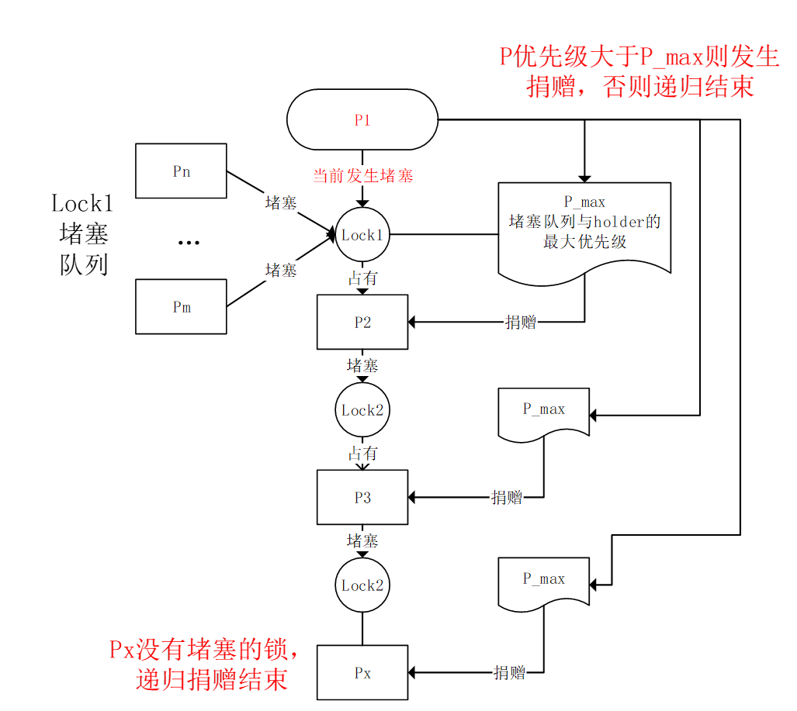
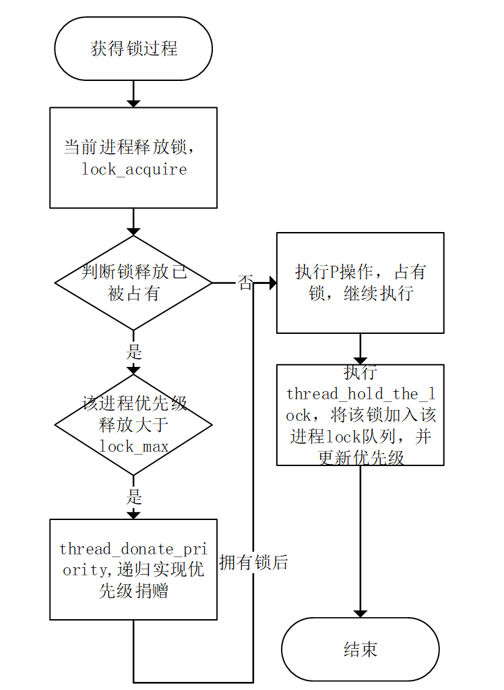
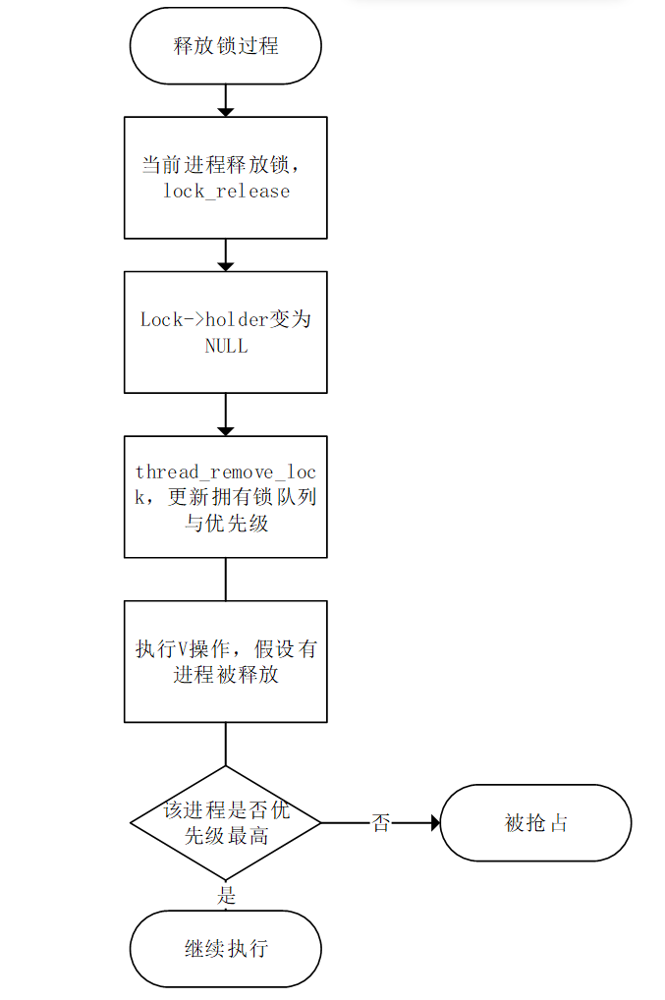

# 1.线程管理框架

详细介绍pintos的线程管理框架，源码中已实现了哪些功能？存在什么问题？

##

# 2.主要函数的功能及实现流程

# 3.Alarm Clock

## 3.1任务描述

在 Pintos 中，线程可以调用如下函数使自己进入睡眠状态：

```
void timer_sleep (int64_t ticks);
```

timer_sleep（ ）对于实时运行的线程非常有用（例如，每秒闪烁一次光标）。 当前的timer_sleep（）实现效率低下，因为它在循环中调用threads_yield（），直到耗尽设定的时间片ticks。这会在线程等待时占用CPU。
您的任务是重新实现 timer_sleep（），以便它在没有任何“忙等待”的情况下高效地执行。实现一个高效的闹钟。

## 3.2数据结构

**(1)睡眠线程队列：**
我们将添加一个sleep_list队列，类似于就绪队列ready_list ，它将保存所有处于睡眠状态的线程。有了这个列表，我们的调度程序将保留一个指向每个睡眠线程的指针，从而可以在以后的每个时钟中断检查是否该唤醒它们。要在timer_init中进行初始化。\
**(2)线程结构：**
我们向 thread.h 中定义的线程结构添加一个新变量wake_time，用来记录线程的唤醒时间。初始化时把该变量设置为 -1。

## 3.3算法流程

**(1)将线程设置为休眠** \
这一步的实现将在改进的函数 thread_sleep 中，即通过调用 timer_sleep来实现睡眠：

```
void timer_sleep (int{64_t ticks) {}
```

函数需要一个参数ticks，即睡眠时间。具体步骤如下：

1. 若ticks<=0，则直接返回；
2. 更新当前线程的wake_time，即现在时间+沉睡时间；
3. 将该线程插入sleep_list升序队列，插入后队列仍保持有序；
4. 调用thread_block，将线程状态设置为 BLOCKED，调度器选择其他进程执行。

**(2)唤醒线程**\
&#160; &#160; &#160; &#160;唤醒休眠线程只需要在每个时钟中断时检查sleep_list是否有要唤醒的线程，时钟中断函数在timer.c的timer_interrupt：

```
static void timer_interrupt (struct intr_frame *args UNUSED)
```

通过循环遍历sleep_list中的元素来实现唤醒；

1. 检查是否遍历结束，是则返回，否则继续；（队列可能为空）
2. 检查队列中当前指向线程的wake_time是否<=当前时间，如果不是则直接退出循环。（只需要检查第一个元素，因为sleep_list已经排序，所以第一个元素总是需要先被唤醒。）；
3. 如果是则唤醒该线程，即将线程从sleep_list中移除，在调用thread_unblock将该线程解除阻塞；
4. 指向队列中下一个线程，跳转到步骤1；

## 3.4设计理由

# 4.Priority Scheduling（优先级调度）

## 4.1任务描述

1.在pintos中，每个线程的优先级值范围为 0（PRI_MIN）到 63（PRI_MAX）。但是，当前的调度只实现了fifo调度策略。需要修改调度程序，以便高优先级线程始终在低优先级线程之前运行（即严格优先级调度）。\
2.修改 3 个 Pintos 同步原语（锁、信号量、条件变量），以便这些共享资源优先选择高优先级线程。\
3.为锁实现优先级捐赠。当一个高优先级线程A必须等待获取一个锁时，这个锁已经被一个低优先级线程B持有，我们暂时将B的优先级提高到A的优先级。\
&#160; &#160; &#160; &#160;不提供优先级捐赠的调度程序容易出现优先级反转问题，即中优先级线程C在高优先级线程A等待低优先级线程B持有的资源时运行。支持优先级捐赠的计划程序将允许B首先运行，以便具有最高优先级的A可以被解除阻止。\
&#160; &#160; &#160; &#160;优先捐赠的实现u有如下要求：

- 1)必须处理来自多个来源的捐赠，
- 2)释放锁时撤消捐赠，
- 3)嵌套/递归捐赠。

## 4.2优先级队列

调度器应选择高优先级线程；

1. 维持就绪队列为一个优先级队列。换一种说法：我们在插入线程到就绪队列的时候保证这个队列是一个优先级队列即可。
2. 每次调度时，都将就绪对列中优先级最高的进程转换成运行态。

## 4.3抢占式优先级调度

我们实现了一个优先级队列， 但是因为这个优先级机制还会引出一系列的问题，观察priority-change，priority-preempt这两个test我们知道创建一个线程的时候， 如果线程高于当前线程就先执行创建的线程；如果当前运行线程降低自身优先级后（只能运行态线程对自己执行），就绪队列中有优先级更高的线程就该执行优先级最高的线程。
根据官方文档中的任务描述与测试点的要求，有如下几点：

1. 高优先级线程就绪时，应抢占；
2. 当前线程降低自身优先级后，应yield；

## 4.4锁、信号量、条件变量

 三个同步原语定义在synch.h，实现在synch.c，我们需要保证每次从其维护的阻塞队列中取出的线程是优先级最高的线程。

## 4.5优先级捐赠

### 4.5.1数据结构

考虑优先级的捐赠，这是一个进程堵塞在一个锁上时发生的，如果要实现优先级的递归捐赠 1）知道这个锁现在维护得最大优先级（max{waiters,holder}），我们在锁上加一个max_priority；2）要知道这个锁占有者等待的锁，我们在thread上加一个lock_waiting。
考虑优先级的回收，这是一个进程释放锁时发生的，我们要知道释放这个锁后进程优先级的变化，所以我们在进程加一个locks ，还需要知道进程的真实优先级，在thread上加一个base_priority。

(1)锁

```
struct lock {
    int max_priority; /*锁现在维护得最大优先级:max{waiters,holder}*/
}
```

(2)线程结构

```
struct thread{
    int base_priority;    /* 原始优先级(回收时用)*/
    struct list locks_hold;    /* 拥有的锁(回收时用)*/
    struct lock *lock_wait;    /*被堵塞的锁(捐赠时用)*/
}
```

### 4.5.2算法流程

(1)优先级捐赠（有线程堵塞在锁上时）\
<div  align="center">    
 
</div>
 在一个线程堵塞在一个锁的时候， 如果拥有这个锁的线程优先级比自己低就提高它的优先级，并且如果这个锁还被别的锁锁着， 将会递归地捐赠优先级， 然后在这个线程释放掉这个锁之后恢复未捐赠逻辑下的优先级。\
<div  align="center">    
 
</div>
(2)优先级回收（有线程释放锁时）
<div  align="center">    
 
</div>

